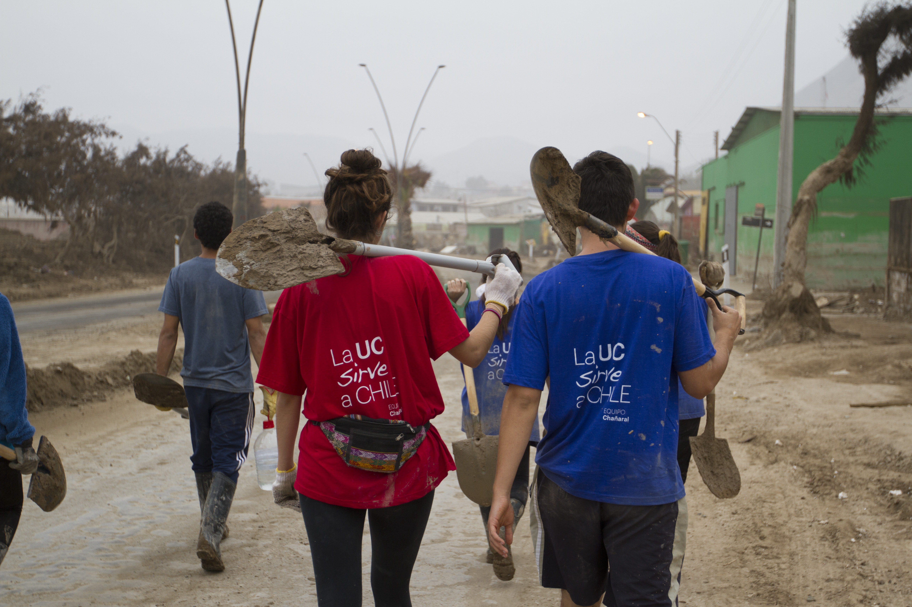

# Plan de Desarrollo

### Introducción

"El Plan de Desarrollo 2015 – 2020 que presentamos constituye el resultado de un proceso colaborativo que hemos realizado al interior de nuestra comunidad al iniciar mi segundo periodo como rector de la Pontificia Universidad Católica de Chile. Este documento define las principales líneas de acción que guiarán nuestra labor durante el próximo quinquenio"

  
  
Ignacio Sánchez  
Rector  
  
Descarga el documento completo  
[https://drive.google.com/file/d/1i8y0DvBoOWXKAWKrkpgfyHuPWKSwpptI/view?usp=sharing](https://drive.google.com/file/d/1i8y0DvBoOWXKAWKrkpgfyHuPWKSwpptI/view?usp=sharing)  
  
Descarga el Plan de Desarrollo  
[https://drive.google.com/file/d/1KlX0cAyzCWtuPsiQXyK38Od1s0aVtVMz/view?usp=sharing](https://drive.google.com/file/d/1KlX0cAyzCWtuPsiQXyK38Od1s0aVtVMz/view?usp=sharing)

| Nuestra Misión | Nuestra Visión |
| :--- | :--- |
| Excelencia en conocimiento y formación | Ser una universidad de frontera |
| La Pontificia Universidad Católica de Chile aspira a lograr la excelencia en la creación y transferencia de conocimiento y en la formación de las personas, inspirada en una concepción católica y siempre al servicio de la Iglesia y de la sociedad. | Nos orientamos a construir una universidad de frontera que, a partir de su identidad católica, imagina nuevas realidades, amplía oportunidades y se compromete con la sociedad. |

###  Plan de Desarrollo

2015 - 2020

El Plan de Desarrollo de la Universidad Católica para el próximo quinquenio ha sido elaborado teniendo a la vista el informe de las más de 120 reuniones que sostuvo este comité con representantes de todos los estamentos de la universidad. Asimismo, en el diseño de esta propuesta se han contemplado las reflexiones, las inquietudes y los aportes que efectuaron más de ochocientas personas dentro del contexto de La UC Dialoga.

**Ejes transversales de la misión**

Identidad Católica  
Comunidad UC

**Ejes específicos**

Creación de conocimiento de frontera  
****Innovación en la docencia  
Inclusión para ampliar oportunidades  
Interdisciplina para los grandes desafíos  
Internacionalización para participar en un mundo global  
Compromiso público de la UC

**Ejes de gestión institucional**

Gestión para el crecimiento, la innovación y la proyección de la UC

### Ejes transversales

  
**Nuestra identidad**

  
****La identidad de la universidad no es solo lo que nos distingue; es también lo que nos inspira. Por ello, nuestra identidad cruza de modo transversal el Plan de Desarrollo. Desde 1888 la UC nace con la misión de ofrecerle al país y a sus jóvenes una forma de educación distintiva, basada en los valores de la Iglesia Católica. La Declaración de Principios de la Pontificia Universidad Católica de Chile y la Constitución Apostólica Ex Corde Ecclesiae, promulgada por Juan Pablo II hace 25 años, son los documentos que orientan su quehacer y definen su identidad.

Más sobre nuestra identidad  
[https://drive.google.com/file/d/1NOw-gDC4c8o3xjJ8gaufRuFpj9tOEwO5/view?usp=sharing](https://drive.google.com/file/d/1NOw-gDC4c8o3xjJ8gaufRuFpj9tOEwO5/view?usp=sharing)

**Comunidad UC**

  
La comunidad UC, integrada por alumnos, profesores, profesionales, personal administrativo, exalumnos y exprofesores, es y seguirá siendo una preocupación permanente de nuestra universidad. Las personas que conforman la UC constituyen un importante pilar y fundamento para el éxito de este plan. Entendemos que para poder construir una gran universidad es necesario que todos sus miembros se sientan responsables de su destino.

Más sobre la comunidad UC  
[https://drive.google.com/file/d/15CleDU5ZvaGxa7ElY8mb55Y-8RiMRiCy/view?usp=sharing](https://drive.google.com/file/d/15CleDU5ZvaGxa7ElY8mb55Y-8RiMRiCy/view?usp=sharing)

### Ejes específicos

**Creación de conocimiento de frontera**

  
****  
Durante el próximo quinquenio nos proponemos aumentar fuertemente el impacto y el volumen de nuestra investigación, para lo cual se requiere incorporar un mayor número de profesores de planta ordinaria para esa labor.

¿Qué estamos haciendo?  
Descarga el eje  
[https://drive.google.com/file/d/17MnWlT-BCi-o8kt8LjrDYTfO0iJFRpT2/view?usp=sharing](https://drive.google.com/file/d/17MnWlT-BCi-o8kt8LjrDYTfO0iJFRpT2/view?usp=sharing)  
  
**Innovación en la docencia**

  
Las mejores universidades del mundo han sido capaces de adaptarse al uso de las nuevas herramientas tecnológicas para actividades que van desde el apoyo a la docencia tradicional hasta el desarrollo de programas y carreras en modalidad virtual. Estos cambios no han sido asumidos con decisión por parte de nuestra universidad, y de aquí el desafío.

¿Cómo innovamos?  
Descarga el eje  
[https://drive.google.com/file/d/169TeK0uSuP6RBYTw4fm\_xipnFg-EH6M9/view?usp=sharing](https://drive.google.com/file/d/169TeK0uSuP6RBYTw4fm_xipnFg-EH6M9/view?usp=sharing)

**Inclusión para ampliar oportunidades**

  
  
****Cuando hablamos de inclusión en la UC lo hacemos con el convencimiento de que tenemos el deber y el compromiso de incluir a personas con talento que no han podido ser parte de nuestra comunidad en el pasado. Toda la universidad crece al estar en contacto y diálogo permanente con personas que provienen de diferentes realidades sociales, geográficas y culturales, entre otras.

¿Cómo incluimos?  
Descarga el eje  
[https://drive.google.com/file/d/12mioZtZiMmroCAWtu12lf6n\_6W3Zo6j-/view?usp=sharing](https://drive.google.com/file/d/12mioZtZiMmroCAWtu12lf6n_6W3Zo6j-/view?usp=sharing)

**Interdisciplina para los grandes desafíos**

  
  
****Existe una profunda convicción en la comunidad UC de que el trabajo académico en el futuro, tanto en creación de conocimiento como en formación de personas, será bajo esta modalidad. En consonancia con ello, esta dimensión tiene significativos espacios de crecimiento.

¿Cómo trabajamos?  
Descarga el eje  
[https://drive.google.com/file/d/10cdi81jL5eclyEKbHzb4FCdCxgpLWaWC/view?usp=sharing](https://drive.google.com/file/d/10cdi81jL5eclyEKbHzb4FCdCxgpLWaWC/view?usp=sharing)

**Internacionalización para participar en un mundo global**

  
****  
En la medida en que una institución se abre al mundo, comienza a adquirir las prácticas de las mejores universidades para poder competir en el concierto internacional. La mayoría de los problemas de frontera que se abordan en investigación hoy son globales y ya nadie discute que la experiencia universitaria con pares extranjeros enriquece tanto la formación de estudiantes como la de profesores. Estos conceptos refuerzan esa mirada.  
  
¿Cómo nos conectamos con el mundo?  
Descarga el eje  
[https://drive.google.com/file/d/1ijCWpboGUX-E5QS2YIqAnOYgnW9T16qK/view?usp=sharing](https://drive.google.com/file/d/1ijCWpboGUX-E5QS2YIqAnOYgnW9T16qK/view?usp=sharing)  
  
**Compromiso público de la UC**

  
****  
En los últimos años se ha instalado la discusión sobre el rol y el compromiso de las universidades chilenas. Al respecto, nuestra postura ha sido clara en el sentido de que el carácter público de una institución no está determinado por su propiedad sino por su preocupación, compromiso, interés social y aporte al desarrollo del bien común.

¿Cómo aportamos a Chile?  
Descarga el eje  
[https://drive.google.com/file/d/1JlQ4tKmwMvzrbhXpgmMaIROzzKqI8AS\_/view?usp=sharing](https://drive.google.com/file/d/1JlQ4tKmwMvzrbhXpgmMaIROzzKqI8AS_/view?usp=sharing)

### Eje de gestión institucional como sustento de nuestro quehacer

**Gestión para el crecimiento, la innovación y la proyección de la UC**

  
  
Con el fin de resguardar nuestra identidad y sentido de comunidad, y de avanzar en los ejes específicos del Plan de Desarrollo que se ha definido, es preciso disponer de una adecuada organización, planificación, capacidad de gestión y financiamiento. Estos aspectos son los que nos permitirán abordar de manera adecuada nuestra propuesta y hacer frente a las diversas coyunturas.

¿Cómo aportamos a Chile?  
Descarga el eje  
[https://drive.google.com/file/d/1o1u-F4aYgJDne2JaDhvzAIROqJxyLkoZ/view?usp=sharing](https://drive.google.com/file/d/1o1u-F4aYgJDne2JaDhvzAIROqJxyLkoZ/view?usp=sharing)

