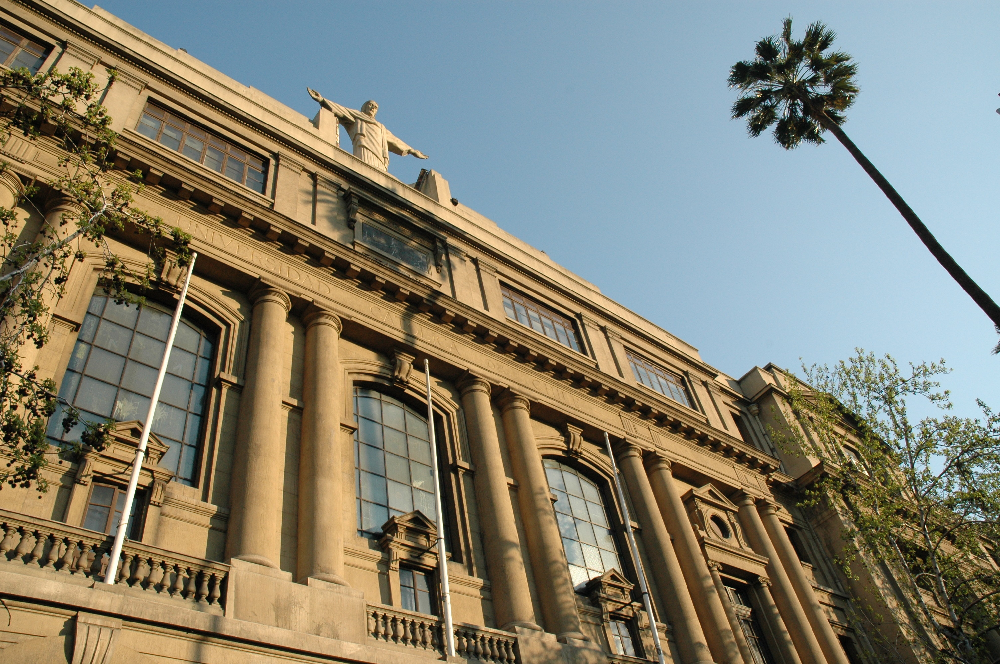
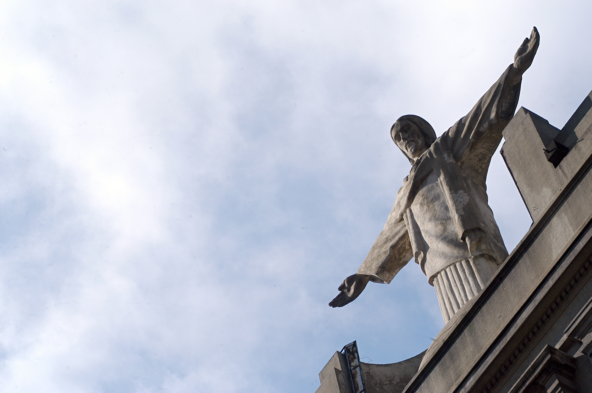
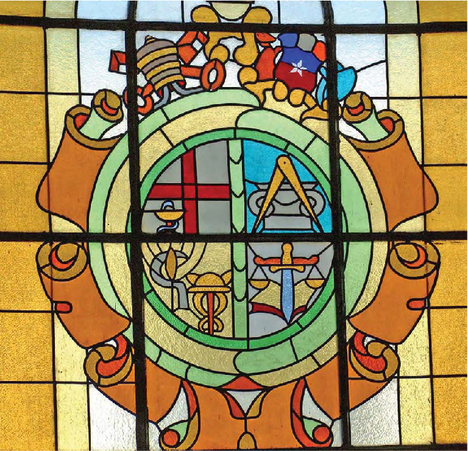
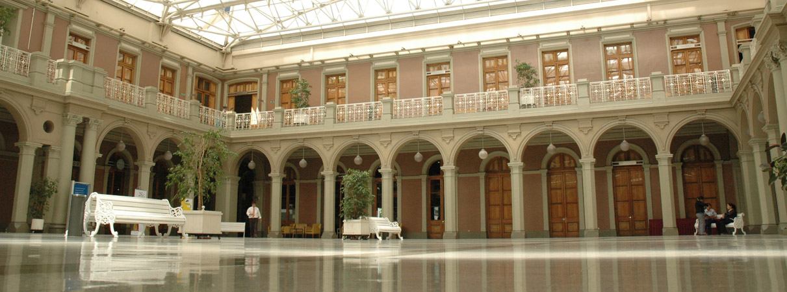

# Símbolos Identitarios

## **Símbolos identitarios**

Aquí te mostramos cómo se ha forjado la identidad de la Universidad a través del tiempo con símbolos que se han convertido en **íconos de nuestra institución**. 

### Escudo y Texto

Imágenes: 





Alt: Escudo Pontificia Universidad Católica de Chile

El **escudo universitario fue creado en 1920** durante la rectoría de Monseñor Carlos Casanueva. 

Es parte fundamental de nuestra imagen institucional e identidad **reflejando aspectos relevantes** que nos caracterizan, tales como **nuestra condición de pontificia y chilena.** 

El escudo ha evolucionado desde su creación hasta una **última versión, diseñada en la rectoría de Ignacio Sánchez**. Los hitos más importantes de esta evolución han sido:

* La incorporación de la corona del Sagrado Corazón en 1930 cuando la universidad fue erigida canónicamente por la Santa Sede.
* La incorporación gradual de la palabra Pontificia desde la década de los 70.
* El uso de software para delinear el nuevo boceto en la década de los noventa.
* El diseño conmemorativo de los 125 años en 2013 y el de los 130 años en 2018. 

### Bandera

Foto:



Alt: Bandera, Pontificia Universidad Católica de Chile  
Los elementos que caracterizan nuestra bandera institucional son un fondo blanco atravesado por una franja azul, y el escudo a color de la universidad.  

### Himno

El himno fue compuesto por Alberto Buccicardi, Charles Brown y Pedro Fornazari. La melodía original está inspirada en la canción: “Tramp, tramp, tramp, the boys are marching” del año 1864. Dicha canción fue compuesta por George F. Root durante la Guerra Civil Norteamericana, para llevar esperanza a los prisioneros de la guerra. 

**El himno UC fue utilizado por primera vez en 1937 para alentar al equipo de fútbol de la universidad.** 

Con los años y tras los arreglos musicales de Vicente Bianchi, el himno tomó su versión final. Se popularizó durante la rectoría de Fernando Castillo Velasco al usarse tanto como himno oficial de la Universidad, así como cortina musical del inicio de transmisiones de Canal 13, cuando eran instituciones conjuntas.  

#### Letra del himno

I

Alta la frente al cielo y con fe hacia el porvenir llena de luz nos guía el Alma Máter inmortal.  

II

Cruzados Caballeros serenos de noble ambición tenemos como escudo en el pecho nuestro corazón.  

Coro:

Universidad Católica juntos vibremos con ardor y llevando en el alma un deseo de triunfar por la Patria, Dios y la Universidad. III Forjando nuevas rutas en busca del ideal al son de ritmo y canto que ennoblece la ambición.  

IV

Azul y blanco lleva en sí nuestro pabellón fulgen de allí destellos que hablan de nuestra Universidad. Coro Universidad Católica juntos vibremos con ardor y llevando en el alma un deseo de triunfar por la Patria, Dios y la Universidad.  

[Escucha la versión coral](https://drive.google.com/open?id=19NTTWAR8rz8SHrF6LzCo0QzWnOBB7zgr)

[Escucha la versión instrumental](https://drive.google.com/open?id=1Uvev5AC--dsC0G7z4dE5ap64F6rb9XQ1)

### Oración al Sagrado Corazón UC

Nuestra institución ha crecido y se ha consolidado al ritmo de los acontecimientos históricos que ha atravesado nuestro país, siempre enraizada en su sólida identidad católica al servicio de Dios y de la Patria.

En este recorrido, **la figura de nuestro patrono, el Sagrado Corazón, ha sido fundamental**. En su amor misericordioso, humilde y sencillo se funda nuestro sello como institución, la cual trabaja incansablemente en la búsqueda de la verdad y la formación integral de cada uno de sus estudiantes.  

Para más información sobre la historia de esta devoción en la universidad, revisa el texto [Sagrado Corazón en el corazón de la UC.](http://pastoral.uc.cl/wp-content/recursos/publicaciones/Mes-del-Sagrado-Corazon-2013.pdf)

#### Oración al Sagrado Corazón UC:

 Oh Divino Jesús, que eres el Señor de las Ciencias, en cuyo corazón están encerrados todos los tesoros de la Sabiduría. Nosotros, aquí reunidos: profesores, alumnos y funcionarios de la Universidad Católica de Chile venimos a consagrar a tu Sacratísimo Corazón toda esta familia universitaria que tanto amas y que te reconoce como su Maestro, su Señor, su Bienhechor, su Dios. 

Te consagramos toda la obra que en ella se hace y pueda hacerse para que toda entera se ordene a tu Divina Gracia. Queremos que nuestra Universidad; por las ciencias, las virtudes y piedad religiosa de sus maestros y alumnos; extienda más y más entre nosotros nuestro reino. “Reino de la Verdad y de la Gracia, de la Justicia, del Amor y de la Paz”. Queremos que sea toda su actividad como una continua ofrenda de adoración, de acción de gracias, de reparación y de súplicas que llegue hasta Ti… 

Y toma en cambio, como tuyos, todos nuestros anhelos e intereses, toda la vida y el progreso de nuestra Universidad; bendice a todos los que formamos parte de ella y a todos los que la favorezcan, la sirven y la aman; y graba en tu Corazón Sacratísimo nuestros nombres. 

Que tu Amor Infinito a todos los guarde y encamine al Cielo.

Amén.  

### Estatua del Sagrado Corazón

  
Foto: [https://www.uc.cl/images/stories/simbolos/sagrado\_corazon.jpg](https://www.uc.cl/images/stories/simbolos/sagrado_corazon.jpg)

Propuesta 1:

Alt: Estatua del Sagrado Corazón, Pontificia Universidad Católica de Chile

  
La característica imagen de Cristo sobre la Universidad Católica tiene su origen **el 14 de mayo de 1931, cuando un incendio afectó a las facultades de Ingeniería y Arquitectura**, ubicadas en el tercer y cuarto piso del Palacio Universitario. El rector de la época, **Monseñor Carlos Casanueva, rogó al Sagrado Corazón de Jesús que le ayudara a recuperar lo perdido**. Menos de dos años duró la reconstrucción total de las instalaciones y **en señal de agradecimiento en 1935 monseñor Casanueva instaló la estatua del Sagrado Corazón de Jesús** que hasta hoy se levanta en el frontis de la Casa Central. La estatua del Sagrado Corazón solo ha tenido un cambio, específicamente en una de sus manos, tras el terremoto de 1985.  

### El Cristo de San Joaquín

Foto: https://www.uc.cl/images/stories/simbolos/cristo\_san\_joaquin.jpg

  
Alt. El Cristo de San Joaquín, Pontificia Universidad Católica de Chile

Texto:  
El Cristo que recibe a la comunidad de la UC en el campus San Joaquín desde el año 1982 fue obra del escultor Hernán Puelma. Se trata de una escultura forjada en bronce de 500 x 300 x 100 centímetros.  

### Vitral de Casa Central

  
Foto: https://www.uc.cl/images/stories/simbolos/vitrales.jpg

  
Alt. Vitral de Casa Central, Pontificia Universidad Católica de Chile

Texto:  
El vitral de la caja de las escaleras en el acceso a la capilla de la Casa Central fue diseñado por Adolfo Winterlitz e inaugurado en 1931. En 1988 fue utilizado como símbolo en la celebración del Centenario.  

### [Casa Central](campus/campus-casa-central.md)

### [Campus Lo Contador](campus/campus-lo-contador.md)

### [Campus Oriente](campus/campus-oriente.md)

### [Campus San Joaquín](campus/campus-san-joaquin.md)

### [Campus Villarrica](campus/campus-villarrica.md)

### Centro de Extensión

Imagen: [http://centroeventos.uc.cl/wp-content/uploads/2017/05/Centro-Ext-plaza-central-slider.jpg](http://centroeventos.uc.cl/wp-content/uploads/2017/05/Centro-Ext-plaza-central-slider.jpg)

Ubicado en las antiguas instalaciones del Instituto de Humanidades Luis Campino, el Centro de Extensión fue fundado bajo el rectorado del rector Juan de Dios Vial en la década de los ochenta. Su objetivo era servir como espacio cultural para la difusión de las artes, la transferencia de conocimiento, la capacitación de alto nivel y la perfección cultural bajo el signo de la educación continua.

Mascota UC

Durante el año 2018, luego de un proceso de participación, diseño colaborativo y concursos, se lograron recoger ideas, percepciones, simbolismos, valores y espíritu deseado para una mascota UC. 

**El animal elegido fue el puma**, **mamífero típico de Chile, que se caracteriza por su astucia, valentía y autonomía**. Su presencia en el ecosistema es clave para mantener el equilibrio natural.

Fuente: http://mascotauc.cl/pagina-4.html  

