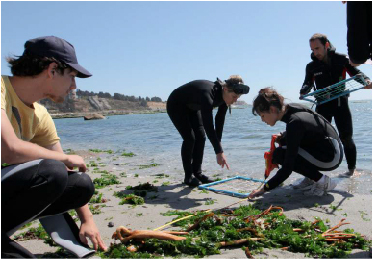
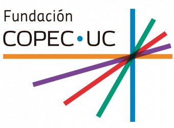

# Landing principal

## La Universidad

La Pontificia Universidad Católica de Chile aspira a lograr la excelencia en la creación y transferencia de conocimiento y en la formación de las personas, basada en una concepción católica y siempre al servicio de la Iglesia y de la sociedad.

En esta sección

* Nuestra excelencia
* Organización
* Nuestra identidad
* Plan de Desarrollo 2015-2020
* Organizaciones vinculadas

### Nuestra excelencia

Tenemos un compromiso permanente con la calidad, como una forma de expresión de nuestro servicio. Este sello es parte de nuestra misión fundacional. Nos esforzamos por realizar esta labor en forma rigurosa, con altos estándares académicos y adoptando las prácticas internacionales de las mejores universidades.

* N°1 En Latinoamérica. Ranking QS 2019
* N°132 En el mundo. Ranking QS 2019
* 7 Años de acreditación en las 5 áreas evaluadas por la Comisión Nacional de Acreditación \(CNA\).
* N°1 En Chile en solicitudes de patentes de invención.

[Conoce nuestras cifras.](hechos-y-cifras.md)

### Organización

A continuación te presentamos el organigrama de nuestra Universidad.

[Gran Cancillería](organizacion/gran-cancilleria/)

[Vice Gran Cancillería](organizacion/vice-gran-cancilleria/)

[Honorable Consejo Superior](organizacion/honorable-consejo-superior.md)

[Rectoría](organizacion/rectoria/)

[Secretaría General](organizacion/secretaria-general/)

[Prorrectoría](organizacion/prorrectoria/)

[Prorrectoría de Gestión Institucional](organizacion/prorrectoria-de-gestion-institucional/)

[Vicerrectoría Académica](organizacion/vicerrectoria-academica/)

[Vicerrectoría de Investigación](organizacion/vicerrectoria-de-investigacion/)

[Vicerrectoría Económica](organizacion/vicerrectoria-economica/)

[Vicerrectoría de Comunicaciones](organizacion/vicerrectoria-de-comunicaciones/)

### Cajas

* Pastoral UC [\(ir al sitio\)](http://pastoral.uc.cl)
* Ombudsman [\(ir al sitio\)](http://ombudsman.uc.cl/)
* Observatorio Nueva Evangelización [\(ir al sitio\)](http://observatorionuevaevangelizacion.uc.cl/)

### Nuestros campus

La Universidad Católica cuenta con cuatro campus en Santiago, Región Metropolitana, y uno en Villarrica, Región de la Araucanía. Cada uno tiene su propia identidad y se vincula a un momento distinto dentro de la historia universitaria. 

[Campus Oriente](campus/campus-oriente.md)

[Campus San Joaquín](campus/campus-san-joaquin.md)

[Casa Central](campus/campus-casa-central.md)

[Campus Lo Contador](campus/campus-lo-contador.md)

[Campus Villarrica](campus/campus-villarrica.md)

### Nuestras facultades

La UC está conformada por 18 facultades más un instituto interdisciplinario, el Programa College UC y el campus Villarrica. Juntos abarcan todas las áreas del conocimiento. 

Caja:

[Conoce nuestras facultades](../facultades-escuelas-e-institutos/listado-de-facultades.md)

### Nuestra identidad

La UC nace con la misión de ofrecerle al país y a sus jóvenes una forma de educación distintiva, basada en los valores de la Iglesia Católica. Somos una institución de función y vocación pública, y con nuestro quehacer generamos bienes que se orientan a hacer de Chile un país mejor.

* [Principios](http://secretariageneral.uc.cl/documento/normas-generales/113-declaracion-de-principios/file)
* [Proyecto educativo](http://admisionyregistros.uc.cl/alumnos/programas-estudio/proyecto-educativo-2)
* [Estatutos](http://secretariageneral.uc.cl/documento/normas-generales/111-estatutos-generales/file)
* [Símbolos identitarios](simbolos-identitarios.md)
* [Código de honor](codigo-de-honor.md)

### Nuestra historia

La historia de la Universidad ha caminado de la mano con la historia de Chile. Desde nuestros fundadores hasta el día de hoy, miles de hombres y mujeres se han formado aquí para luego cumplir tareas relevantes en el desarrollo de la patria. Este compromiso responde a nuestra misión de formar personas integrales, hacer crecer el conocimiento y aportar al desarrollo de la sociedad.

Caja: 

[Conoce nuestra historia](historia.md)

### Plan de Desarrollo 2015-2020

Estos son los pilares que orientan nuestra actividad universitaria. El Plan de Desarrollo se estructura en torno a dos ejes transversales, seis específicos y uno vinculado a la gestión institucional. Los dos primeros se orientan a fortalecer lo que nos distingue: nuestra identidad católica y nuestro sentido de comunidad universitaria. Los seis ejes siguientes constituyen los focos estratégicos.

Creación de conocimiento de frontera

[Descargar](https://www.uc.cl/images/stories/Plan_de_desarrollo_2015_2020/Conocimiento_de_frontera.pdf)

Innovación en la docencia

[Descargar](https://www.uc.cl/images/stories/Plan_de_desarrollo_2015_2020/Innovacion_docencia.pdf)

Inclusión para ampliar oportunidades

[Descargar](https://www.uc.cl/images/stories/Plan_de_desarrollo_2015_2020/Interdisciplina.pdf)

Interdisciplina para los grandes desafíos

[Descargar](https://www.uc.cl/images/stories/Plan_de_desarrollo_2015_2020/Interdisciplina.pdf)

Internacionalización 

[Descargar](https://www.uc.cl/images/stories/Plan_de_desarrollo_2015_2020/Internacionalizacion.pdf)

Compromiso público de la UC

Propuesta de foto1:

Propuesta de foto 2:

[Descargar](https://www.uc.cl/images/stories/Plan_de_desarrollo_2015_2020/Compromiso_publico.pdf)

[Conoce nuestro plan de desarrollo](plan-de-desarrollo.md)

### Organizaciones vinculadas

La Universidad comparte y colabora con el trabajo de otras instituciones que también están inspiradas en valores católicos, al servicio de la Iglesia y del país. Las siguientes son algunas de las entidades relacionadas con la UC.

[Iglesia](http://www.iglesia.cl/)

[Fundación Vida Rural](http://www.fvrpuc.cl/)

[Club Deportivo Universidad Católica](http://www.lacatolica.cl/)

[Duoc UC](http://www.duoc.cl/inicio)

[DICTUC](https://www.dictuc.cl/)

[Fundación Copec UC](http://www.fundcopec-uc.cl/)

[Instituto Catequístico Universidad Católica](http://institutocatequistico.uc.cl/)

[Red de Salud UC Christus](http://redsalud.uc.cl/ucchristus/)

[Hospital Josefina Martínez](http://www.hospitaljosefinamartinez.cl/)

[Friends UC](http://friends-uc.org/)

### Footer

